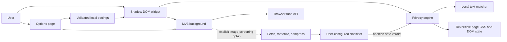

# Privacy Lens architecture

Privacy Lens is a dependency-free Manifest V3 runtime with separate boundaries
for validated settings, deterministic matching, reversible page effects,
browser-tab orchestration, and the optional classifier network port.

## Module boundaries

| Module | Responsibility | Data ownership |
| --- | --- | --- |
| `shared/settings.js` | Schema, migrations, bounds, URL and regex validation | Browser local/session storage |
| `content/matcher.js` | Built-in, literal, and bounded regex matching | No persisted data |
| `content/privacy-engine.js` | Reversible effects, media stamps, verdict states, title restoration | Per-page state only |
| `content/content-script.js` | Draggable widget and runtime message handling | Per-frame UI state |
| `background.js` | Toolbar action, title sessions, and optional classifier port | Session tab IDs |
| `options/` | Preferences, regex editor, site rules, and tab selector | Draft form state |

## Classifier data flow

1. The user explicitly enables NSFW screening and selects that image treatment.
2. The page image is blacked out immediately.
3. The background fetches it without credentials or a referrer.
4. The background rasterizes it to a JPEG no larger than 512 px.
5. A multipart request sends the JPEG, extension version, and maximum dimension.
6. A valid `safe: true` response reveals the original. Every other state stays
   concealed.

The extension sends no source URL, page URL, page title, page text, tab ID,
browsing history, custom term, or regex rule. The endpoint contract is
documented at https://labs.wiplash.ai/privacy-lens/api-docs/.

## Key risks and mitigations

| Risk | Mitigation |
| --- | --- |
| False-safe classifier verdict | Feature is optional and model-agnostic; images reveal only on explicit boolean safe |
| Classifier outage or malformed response | 12-second timeout, strict response bounds, fail-closed rendering |
| Image disclosure | Explicit opt-in, endpoint control, compression, and no page/source metadata |
| Expensive custom regex | Rule, length, node, and match caps plus rejection of risky constructs |
| Broad page access | No scripting or network-interception permissions; strict message/input validation |

Runtime dependencies: zero. Development dependencies: Playwright and jsdom.
