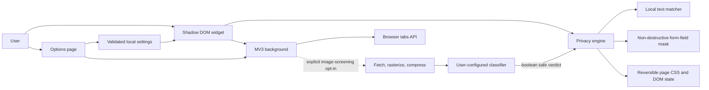

# Privacy Lens architecture

Privacy Lens is a dependency-free Manifest V3 runtime with separate boundaries
for validated settings, deterministic matching, reversible page effects,
browser-tab orchestration, and the optional classifier network port.

## Module boundaries

| Module | Responsibility | Data ownership |
| --- | --- | --- |
| `shared/settings.js` | Schema, migrations, bounds, URL and regex validation | Browser local/session storage |
| `content/matcher.js` | Built-in, literal, and bounded regex matching | No persisted data |
| `content/privacy-engine.js` | Reversible effects, visual form masks, image verdict states, title restoration | Per-page state only |
| `content/content-script.js` | Draggable widget and runtime message handling | Per-frame UI state |
| `background.js` | Toolbar action, title sessions, and optional classifier port | Session tab IDs |
| `options/` | Preferences, regex editor, site rules, and tab selector | Draft form state |

## Classifier data flow

1. The user explicitly enables NSFW screening and selects that image treatment.
2. The page image is blacked out immediately.
3. The background fetches it without credentials or a referrer.
4. The background rasterizes it to a JPEG no larger than 512 px.
5. A multipart request sends the JPEG, extension version, and maximum dimension.
6. A valid `safe: true` response reveals the original. Every other state stays
   concealed.

The extension sends no source URL, page URL, page title, page text, tab ID,
browsing history, custom term, or regex rule. The endpoint contract is
documented at https://labs.wiplash.ai/privacy-lens/api-docs/.

## Form-field masking decision

- **Status:** Accepted for v1.
- **Context:** A screen recording can expose secrets while they are typed even
  if static page text is already protected.
- **Decision:** The Secrets layer reads candidate values locally and applies an
  opaque-redaction or blur style to the whole matching field. It never writes a
  replacement into `value` or editable text. Semantic email, telephone,
  password, payment-card, and crypto fields conceal from the first character;
  generic controls conceal once a deterministic rule matches.
- **Consequences:** The user cannot visually inspect a concealed value without
  turning Secrets off, but page validation and submission continue to receive
  the untouched value. Matching form fields is enabled by default and can be
  disabled globally.
- **Alternative considered:** Replacing the value with mask characters was
  rejected because it would corrupt page state, validation, copy/paste, and
  submissions.

## Key risks and mitigations

| Risk | Mitigation |
| --- | --- |
| False-safe classifier verdict | Feature is optional and model-agnostic; images reveal only on explicit boolean safe |
| Classifier outage or malformed response | 12-second timeout, strict response bounds, fail-closed rendering |
| Image disclosure | Explicit opt-in, endpoint control, compression, and no page/source metadata |
| Expensive custom regex | Rule, length, node, and match caps plus rejection of risky constructs |
| Form value corruption | Visual-only CSS marker; the underlying value and editable text are never replaced |
| False-positive payment card | Direct text detection requires a 13–19 digit Luhn-valid number; semantic card fields remain fail-closed while typing |
| Crypto false positives | Direct matching is limited to distinctive address/key formats; generic encodings require crypto context |
| Broad page access | No scripting or network-interception permissions; strict message/input validation |

Runtime dependencies: zero. Development dependencies: Playwright and jsdom.
